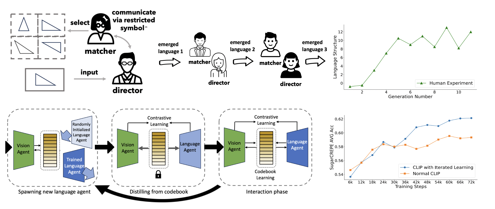

# [CVPR 2024] Iterated Learning Improves Compositionality in Large Vision-Language Models


This is the implemntation of the paper  [Iterated Learning Improves Compositionality in Large Vision-Language Models](https://arxiv.org/abs/2404.02145).

We design an iterated learning algorithm that improves the compositionality in large vision-language models, inspired by cultural transmission theory in cognitive science.



## :wrench: Installation

Please run the following commands to initiate a fresh conda environment and install the required packages.
```bash
conda create -n clipenv python=3.8 
conda activate clipenv
pip install -r requirements.txt
```

To evaluate the model in compositionality benchmarks like [CREPE](https://github.com/RAIVNLab/CREPE), [SugarCREPE](https://github.com/RAIVNLab/sugar-crepe/blob/main/README.md), you need to download their required data. Checkout the correponding repositories for details.

## :keyboard: Usage

#### Evaluate a pretrained model
All the testing scripts are integrated at `test.sh`. To evaluate the model, simply run:

```python
bash test.sh <model-type> <checkpoint-path> <task>
```

`<model-type>` can be  `fdt` if you are evaluating codebook varients of CLIP model (like the model that we use), or   `clip` if evaluting CLIP baseline.

 `<checkpoint-path>` is the folder that contain model checkpoints. 

`<task>` can be one of  `compositionality`, `retrieval`, `recognition`, `probing`. 

Note that we use [clip-benchmark](https://github.com/LAION-AI/CLIP_benchmark) for evaluating recognition and retrieval. It will automatically download the required datasets in `data` folder.

The pretrained model checkpoints can be found [here]()

#### Training CLIP model using iterated learning

First, to prepare the data for training,  we recommand using publically available image-text datasets, such as [Conceptual Captions (CC3M)](https://ai.google.com/research/ConceptualCaptions/), [Conceptual 12M (CC12M)](https://github.com/google-research-datasets/conceptual-12m), and [LAION115M](https://github.com/salesforce/BLIP). [img2dataset](https://github.com/rom1504/img2dataset) is a very convenient tool for downloading these large scale data.

After preparaing the data (cc3m in this example), to train a VIT-B/32 CLIP model using our iterated learning algorithm, please run

```bash
bash run.sh example/clip_fdt/train_solver.py \
    --config example/clip_fdt/config_cc3m.yaml \
    --output_path output \
    --batch_size 256  \
    --exp_name cc3m_IL_6000
```

This scripts assume the usage of 4 gpus in 1 node. You can modify the gpu number and node number in `run.sh`.

#### Training Standard CLIP model as baseline

To train a baseline CLIP model (also ViT-B/32), please run

```bash
bash run.sh example/clip/train_solver.py \
    --config example/clip/config_cc3m.yaml \
    --output_path output \
    --batch_size 256  \
    --exp_name baseline_clip
```


## :paperclip: Cite
If you find this repository useful, please consider citing:
```bibtex
@inproceedings{hsieh2023sugarcrepe,
  title={SugarCrepe: Fixing Hackable Benchmarks for Vision-Language Compositionality},
  author={Hsieh, Cheng-Yu and Zhang, Jieyu and Ma, Zixian and Kembhavi, Aniruddha and Krishna, Ranjay},
  booktitle={Thirty-Seventh Conference on Neural Information Processing Systems Datasets and Benchmarks Track},
  year={2023}
}
```

## :open_book: Acknowledge
Part of our code is referenced from the following repositories/sources. We thank the authors for making their code available.
* https://github.com/yuxiaochen1103/FDT
* https://github.com/LAION-AI/CLIP_benchmark
* https://github.com/RAIVNLab/sugar-crepe
* https://github.com/RAIVNLab/crepe

